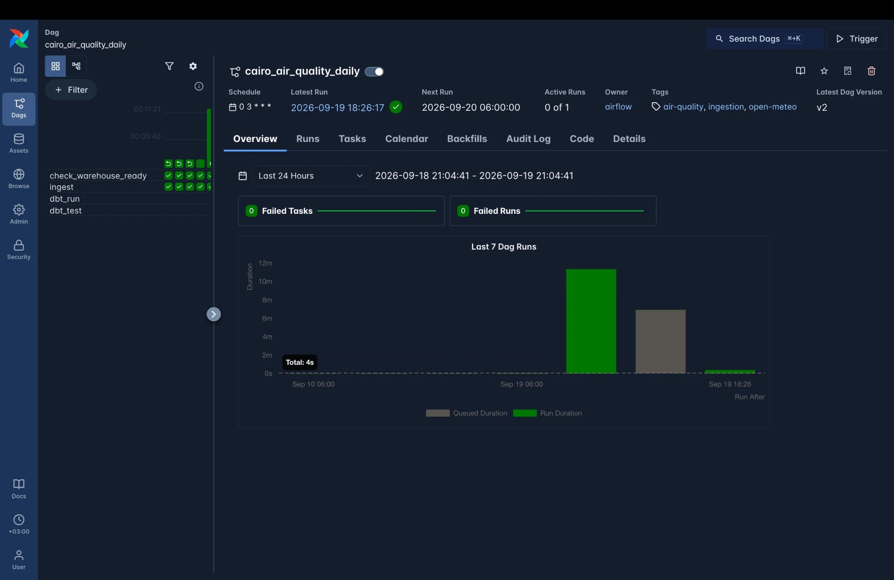
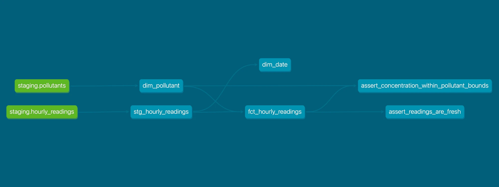

# Cairo Air Quality Pipeline

[](https://github.com/SolyZak/cairo-air-quality-pipeline/actions/workflows/dbt-tests.yml)
[](LICENSE)

A daily pipeline that ingests hourly air quality readings for Cairo from the
[Open-Meteo Air Quality API](https://open-meteo.com/en/docs/air-quality-api),
lands them in Postgres, transforms them into a star schema with dbt, and tests
the result. Orchestrated by Airflow. Everything runs locally with one command.

**Stack:** Python 3.12 · Postgres 16 · Apache Airflow 3.3 (LocalExecutor) ·
dbt-postgres 1.11 · Docker Compose · GitHub Actions



*`check_warehouse_ready → ingest → dbt_run → dbt_test`, running daily at 03:00
UTC. The run history covers all three trigger types — scheduled, manual and
backfill.*



*Lineage from the two source tables through the staging view into the star
schema, and on to the two singular data tests.*

---

## Architecture

```
          Open-Meteo Air Quality API
                     │  hourly PM2.5, PM10, NO2, O3
                     ▼
   ┌─────────────────────────────────────────────┐
   │ ingestion/  (Python)                        │
   │   fetch → validate → land raw → upsert      │
   └─────────────────────────────────────────────┘
                     │
                     ▼
   raw.air_quality_responses     append-only; one row per HTTP call,
                     │           with ingested_at. Never updated.
                     ▼
   staging.hourly_readings       one row per (location, pollutant, hour)
                     │           PK = natural key ⇒ load is idempotent
                     ▼
   ┌─────────────────────────────────────────────┐
   │ dbt                                         │
   │   stg_hourly_readings (view)                │
   │     ├── dim_date                            │
   │     ├── dim_pollutant                       │
   │     └── fct_hourly_readings   (incremental) │
   └─────────────────────────────────────────────┘
                     │
                     ▼
              analytics.*   ← what a dashboard would read

   Airflow DAG: check_warehouse_ready → ingest → dbt_run → dbt_test
```

Three schemas, so the prefix on a table name tells you how much to trust it:

| Schema | Contents | Written by |
|---|---|---|
| `raw` | API responses exactly as received | the loader |
| `staging` | typed, deduplicated measurements | the loader |
| `analytics` | the star schema | dbt |

---

## Quick start

```bash
git clone https://github.com/SolyZak/cairo-air-quality-pipeline.git
cd cairo-air-quality-pipeline
cp .env.example .env
./scripts/gen_secrets.sh      # Fernet key, JWT secret, Airflow admin password
docker compose up -d
```

That is the whole setup. Postgres creates both databases and applies the schema
on first boot; Airflow migrates its metadata database, creates the admin user
and starts unpaused, so the DAG runs by itself.

Then:

- **Airflow UI** → http://localhost:8080 (credentials printed by `gen_secrets.sh`)
- **dbt docs** → `./scripts/dbt_docs.sh`, then http://localhost:8081

```bash
docker compose down       # stop, keep the data
docker compose down -v    # stop and wipe the database
```

### Running pieces by hand

```bash
docker compose run --rm ingest --days 7                             # a scheduled run
docker compose run --rm ingest --start 2026-08-01 --end 2026-08-31  # backfill
docker compose run --rm ingest --dry-run                            # fetch, write nothing

./scripts/dbt.sh build              # dbt run + test
./scripts/dbt.sh run --full-refresh
./scripts/psql.sh                   # psql on the warehouse
./scripts/apply_ddl.sh              # re-apply DDL to a running database
```

---

## Repository layout

```
docker-compose.yml           postgres + 4 Airflow services + the ingest runner
Dockerfile                   python:3.12-slim runner for the ingestion CLI
airflow.Dockerfile           Airflow 3.3.2 + ingestion deps + dbt in its own venv

sql/00_create_airflow_db.sh  Airflow's metadata DB, beside the warehouse
sql/01_schemas.sql           raw / staging / analytics
sql/02_raw.sql               raw.air_quality_responses
sql/03_staging.sql           staging.pollutants, staging.hourly_readings

ingestion/config.py          settings from the environment, validated once
ingestion/open_meteo.py      API client and parsing, with four upstream guards
ingestion/loader.py          raw insert, idempotent staging upsert
ingestion/pipeline.py        fetch → raw → staging, chunked by date window
ingestion/__main__.py        the CLI

dags/cairo_air_quality.py    the DAG

dbt/models/staging/          stg_hourly_readings
dbt/models/marts/            dim_date, dim_pollutant, fct_hourly_readings
dbt/tests/generic/           accepted_range, written locally (no dbt_utils)
dbt/tests/                   freshness, per-pollutant plausibility

tests/                       54 unit tests: parser guards, config, chunking
pytest.ini                   test config
requirements-dev.txt         pytest; runtime images never install it

ci/seed_test_data.sql        deterministic fixture; CI never calls the API
.github/workflows/           unit tests + dbt tests on every push
scripts/                     gen_secrets, apply_ddl, psql, dbt, dbt_docs
```

Run the unit tests locally:

```bash
pip install -r requirements-dev.txt && python -m pytest
```

---

## How it works

### Ingestion

Each run asks the API for a **7-day window** and upserts it. The overlap is the
point: a day that was incomplete when first fetched gets completed by the next
six runs, and a value the API revises gets corrected, without any special
handling.

Before anything is written, four guards run. Each one exists because failing
loudly beats loading plausible-looking nonsense:

| Guard | Catches |
|---|---|
| `utc_offset_seconds != 0` | a timezone change that would shift every timestamp |
| array length mismatch | values silently misaligned against timestamps |
| missing pollutant | a variable dropped from the response |
| unexpected unit | a scale change — mg/m³ would make everything 1000× wrong |

Forecast hours are discarded. Open-Meteo returns the **rest of today** as
prediction: a 7-day request made at 11:34 UTC came back with 12 forecast hours
attached. Writing those into a table called `hourly_readings` would corrupt
every downstream average and let a freshness check pass on data that does not
exist yet.

### Orchestration

The DAG holds no business logic. It decides *when* to run and *which window* to
ask for, then calls the same `run_window()` the CLI uses — one code path, not
two that drift apart.

The window comes from the run's **data interval**, never from today's date.
That is what makes backfill correct: a run for a date last month pulls last
month's data. Using `date.today()` would make every backfill run fetch this
morning.

### Transformation

`stg_hourly_readings` is a thin view — renames, and Cairo local time derived
from the stored UTC. The marts are a conventional star: two dimensions and one
fact at the grain of the measurement.

---

## Why incremental loading, not full refresh

This is the decision the project is really about, so it is worth stating
carefully.

**A full refresh of `fct_hourly_readings` would work fine today.** There are a
few thousand rows; rebuilding takes well under a second. By the usual
"don't optimise prematurely" reasoning, full refresh is the right call.

I chose incremental anyway, because **cost today is the wrong basis for this
particular decision**:

1. **A rebuild scales with the age of the project, not the size of the change.**
   The table grows by 96 rows a day and nothing ever deletes from it. Every
   nightly run would rewrite the entire history to append one day. After a year
   that is ~35k rows rewritten to add 96; after three years, three times that,
   for the same amount of new information. Incremental keeps the nightly cost
   proportional to one day of data, permanently.

2. **The scaling factors are all plausible here.** A second city doubles it. A
   finer pollutant list multiplies it. Moving from hourly to 15-minute readings
   quadruples it. None of those are exotic — they are the obvious next features.

3. **The source is append-mostly with occasional revisions**, which is the exact
   shape incremental models are designed for. Rows arrive with a new timestamp
   and are rarely amended. If the source rewrote history wholesale, incremental
   would be the wrong tool and full refresh would be the honest one.

4. **Rebuilding destroys and recreates the table.** There is a window, however
   short, where a consumer sees a partial table. Appending does not have one.

The trade-offs I accepted:

- **It can drift.** If the incremental filter is wrong, the table silently
  diverges from its source. This is the real cost, and it is mitigated by the
  `unique` test on `reading_key` and by `--full-refresh` being cheap enough to
  run whenever the logic changes.
- **It is harder to read** than `select *`, and the Jinja `is_incremental()`
  block is a genuine extra concept for anyone new to the codebase.

### The part that is easy to get wrong

The filter is on **`loaded_at`** — the loader's watermark — not on
`measured_at_utc`:

```sql

where loaded_at >= (select coalesce(max(source_loaded_at), '1900-01-01') from {{ this }})

```

Filtering on measurement time is the natural-looking choice and it is wrong: it
would never pick up a value the API **revised** for an hour already held,
because that row's `measured_at_utc` has not moved. `loaded_at` has.

This works because the loader only advances `loaded_at` when a value genuinely
changes — its upsert carries `WHERE value IS DISTINCT FROM EXCLUDED.value`. So
the filter selects exactly the new and corrected rows and nothing else.
`IS DISTINCT FROM` rather than `<>` because `value` is nullable and
`NULL <> NULL` is `NULL`, not true; a plain `<>` would rewrite every null row on
every run.

`>=` rather than `>` because rows written in one transaction share a timestamp.
Re-processing a few rows is free — `delete+insert` on the unique key is
idempotent — whereas missing one is not.

*Verified:* tampering with one historical reading produced `changed=1` from the
loader out of 96 submitted, and dbt propagated exactly that row.

---

## Data quality

**98 automated checks** on every push: 54 Python unit tests and 44 dbt checks,
as two parallel CI jobs. They are separate jobs because they fail for unrelated
reasons and only one of them needs a database — a broken parser and a broken
model should not be reported as the same red X.

### Unit tests (54)

Pure functions only: no database, no network, so they run in under a tenth of a
second and cannot be flaky. They cover the four upstream guards, the unit
aliasing (including that GREEK SMALL LETTER MU and MICRO SIGN are genuinely
different characters), the forecast boundary, null preservation,
value-to-timestamp alignment, settings validation, and date-window chunking —
where a property test asserts the windows are contiguous, cover the range
exactly, and never duplicate or skip a date, across six chunk sizes.

The suite was **mutation-tested** rather than assumed to work. Changing the
forecast filter from `>` to `>=` failed exactly the boundary test; making
`normalise_unit` coerce unknown units instead of rejecting them failed four.

### dbt checks (44)

| Layer | Enforces |
|---|---|
| Postgres constraints | what is **impossible** — negative concentrations, timestamps not on the hour, unknown pollutant codes (foreign key) |
| dbt tests | what is **implausible** — a PM2.5 reading of 900, a stale table, a broken key |

Impossible data should never land. Implausible data should land and raise a
flag — you want to see it and decide.

The tests:

- `not_null` and `unique` on every key. The fact's three-column grain is
  policed by a `unique` test on `reading_key`, an md5 of the natural key —
  which exists only so dbt's single-column `unique` test can cover a composite
  grain without adding `dbt_utils` as a dependency.
- `relationships` from the fact to both dimensions.
- `accepted_range` on concentration and hour-of-day, implemented as a
  **local generic test** — fifteen lines of Jinja instead of a package.
- A **per-pollutant** plausibility test that reads `plausible_max` from
  `dim_pollutant`, so bounds are data rather than literals in a YAML file.
- A **48-hour freshness** test. 48 rather than 24 because the DAG is daily and
  one missed run is operational noise; two is a problem.

**Two freshness checks, measuring different things.** `dbt source freshness`
measures *ingestion lag* — how long since the loader last wrote. The singular
test measures *data recency* — how old the newest measurement is. Demonstrated
concretely: on a fixture whose measurements were aged five days but whose
`loaded_at` was current, source freshness **passed** and the recency test
**failed**. That is a pipeline running perfectly against an API serving stale
data, and only one of the two checks notices.

Every test was verified to **fail on injected bad data**, not merely to pass:

| Injected | Outcome |
|---|---|
| PM2.5 = 1500 µg/m³ | per-pollutant test failed; coarse range correctly passed |
| PM2.5 = 99999 | both range tests failed |
| Measurements aged 5 days | freshness test failed |

---

## Backfilling

```bash
docker compose exec airflow-scheduler \
  airflow backfill create --dag-id cairo_air_quality_daily \
  --from-date 2026-09-10 --to-date 2026-09-13
```

> ⚠️ **`--to-date` is parsed as midnight.** The DAG runs at 03:00, so a run whose
> logical date is `2026-09-12T03:00` falls *outside* `--to-date 2026-09-12`. To
> include the 12th, pass `--to-date 2026-09-13`. This fails silently — you get
> one run fewer than you asked for, with no error.

Or without Airflow at all:

```bash
docker compose run --rm ingest --start 2026-08-01 --end 2026-08-31
```

Long ranges are split into 31-day windows. One request for a year would produce
a single enormous JSON document in one raw row: slow to insert, awkward to
inspect, and all-or-nothing on failure.

---

## Design decisions

**One Postgres container, two databases.** Airflow's metadata and the warehouse
have nothing to do with each other and should not share a blast radius — but
two containers would double the memory for no learning value locally.

**`raw` is append-only.** Every call gets a row even if the payload is identical
to yesterday's. When a number looks wrong six weeks later, the original response
is still there to replay from. Deduplication is staging's job.

**`raw` commits before `staging`, in a separate transaction.** A payload that
breaks the parser is exactly the payload worth keeping; one transaction would
roll back the evidence along with the failure. The cost — a raw row with no
staging rows after a failure — is a useful queue of things to investigate.

**The staging primary key *is* the natural key.** `(location_code,
pollutant_code, measured_at_utc)`. Re-running a day changes no row count and
there is no window where the table sits half-empty. No bookkeeping table
tracking which days have been loaded; the constraint does the work.

**UTC in the key, local time derived.** Cairo is UTC+2, UTC+3 under DST. If
local time were the key, one hour would be duplicated and one missing every year
at the DST boundary, and the primary key would reject or mangle them.

**`dim_date` is keyed on the Cairo calendar day.** "What was PM2.5 on Tuesday"
means Tuesday in Cairo, and at +2/+3 the two calendars disagree for two or three
hours of every day. The spine is generated from the range present in the data,
not a hardcoded 2000–2050 range — a dimension full of dates the fact has never
heard of makes "days with no data" unanswerable.

**Egypt's weekend is Friday and Saturday.** `is_weekend` uses ISO days 5 and 6.
The western default would put the weekly traffic-pollution trough on the wrong
days and invert any weekday/weekend comparison.

**Nulls are stored, not dropped.** The API returns null for hours it has no data
for. Keeping the row makes the gap countable; dropping it makes the series look
complete when it is not.

**Two layers of retry.** The HTTP client retries three times seconds apart for
blips (429, 5xx, dropped connections). Airflow retries four times with
exponential backoff — 2, 4, 8, 16 minutes, capped at 30 — for outages. One layer
alone either hammers a dead service or fails a run over a hiccup.

**dbt tasks retry once, not four times.** A failing test is deterministic: the
same bad row fails the same way four times over half an hour, and all that buys
is a later alert.

**`max_active_runs=1`.** Two runs would upsert overlapping windows into the same
key range concurrently — correct thanks to `ON CONFLICT`, but a reliable source
of lock contention, and it keeps backfills readable.

**dbt lives in its own virtualenv inside the Airflow image.** Airflow and dbt
both pin Jinja2, historically to incompatible versions. `/opt/dbt-venv` means
the two dependency trees never meet.

**`dbt run` and `dbt test` are separate Airflow tasks.** `dbt build` is better at
stopping bad data reaching downstream models, but with four models and no
downstream consumers the clearer signal wins: the graph distinguishes "the
models would not build" from "the models built and the data is wrong".

**Airflow logs go to a named volume.** Bind-mounting them means fighting
host/container UID mismatches; the logs are readable in the UI regardless.

**CI never calls the API.** A build that goes red because someone else's service
is having a bad morning teaches you nothing and trains you to ignore failures.
CI seeds a deterministic fixture with timestamps relative to `now()`, so the
freshness rule is still exercised honestly.

**Secrets are generated, never committed.** `gen_secrets.sh` fills the blanks in
`.env` and refuses to overwrite an existing Fernet key — rotating it would make
every already-encrypted Airflow connection unreadable.

---

## Known limitations

Things I left out deliberately, and what I would do instead in production:

- **No migration tool.** `scripts/apply_ddl.sh` re-runs idempotent DDL; it
  cannot drop a column or change a type. A schema change here means
  `docker compose down -v` and a rebuild, which the append-only raw layer makes
  safe. On a real team this would be Alembic or Flyway.
- **One shared database superuser.** The loader, dbt and Airflow all connect as
  the same role. In production each would get a least-privilege role — dbt does
  not need write access to `staging`, and the loader does not need any access to
  `analytics`.
- **Single location, hardcoded to Cairo.** The grain already carries
  `location_code`, so adding cities is a config change rather than a schema
  change, but there is no `dim_location` yet.
- **No integration test of the loader.** The parser is unit-tested and the SQL
  is tested through dbt, but `insert_raw_response` and `upsert_readings` are
  only exercised by running the thing. Testcontainers, or a Postgres service in
  the unit-test job, would close that gap.
- **No alerting.** A failed DAG shows red in the UI and nothing else. Real
  operation needs the failure to reach a human.
- **No BI layer.** `analytics.*` is query-ready but there is no dashboard;
  adding one would mean a tool outside this project's stack.
